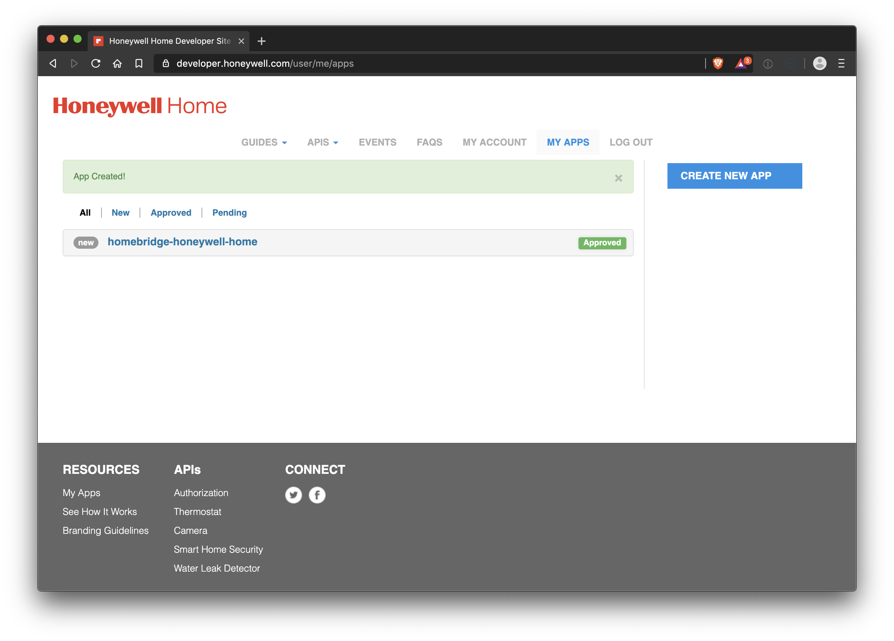

# honeywell-js-setup
Simple web server to retrieve credentials for using the [Honeywell Home service](https://developer.honeywell.com/).

Applications that make use of the Honeywell Home service require [(https://en.wikipedia.org/wiki/OAuth#OAuth_2.0) credentials.

This package started as this [repository](https://github.com/bgraham11/honeywell-js),
and was modified to solely provide this information.

# Installation

    npm install

Yes, there are `5` vulnerabilities; sorry about that!
We're going to run this program just once,
so feel free to submit a PR if you want those to go away.

# API Keys
First,
generate two parameters, a `consumerKey` and a `consumerSecret`:

1. Go to the Honeywell Home [developer site](https://developer.honeywell.com/).

2. If you have already registered, click on `LOGIN`;
otherwise, you will have to create an account, click on `SIGNUP`.

3. Once you have logged in, click on `MY APPS` and then on `CREATE NEW APP`.
You will be asked to enter an `App Name` and a `Callback URL`.
Please enter the values you see here: 
_(Protip: copy-paste the values from the file`config/options.global.js`.)_

4. After you click on `Save Changes`, you will see something like this: 

5. Now click on `homebridge-honeywell-home` and you will see something like this: 

6. Edit the file `config/options.global.js` to include the values shown in your browser, e.g.,

        consumerKey: 'A5nV2bVn7Jzo4FzcZQyADZVGoxSrHAJe',
        consumerSecret: 'xjokooAQHWkqAEel'

7. Click `LOG OUT`.

# Generate OAuth credentials

In the terminal:

    % npm start

This starts a `node ./app.js` process and opens up a browser window:

Click on the `login` link:

Enter the `Email` and `Password` that you use for your
[Honeywell Home App](https://getconnected.honeywellhome.com/en/honeywell-home-app):

Click on `ALLOW`:

Select the devices that you want to manage, by clicking in the upper-right-hand corner of each device.

Click on `CONNECT`:

Very carefully copy-paste the `access_token` and `refresh_token` values.

You will need to enter these *exact* values into the configuration section for your application,
viz., [homebridge-honeywell-home](https://github.com/d0n4v4nb3ck3r/homebridge-honeywellhome).

You can now terminate the `node ./app.js` process started earlier.

Enjoy!
